<div align="center">
  
  <h1>MyShop — Good finds. Made yours.</h1>
  <p><strong>A warm, thoughtfully connected Flutter shopping experience.</strong></p>
  <p>Branded launch · Tactile onboarding · Firebase accounts · Sandbox checkout</p>
  <p>
    <a href="https://husseinabozina.github.io/shop_application/"><strong>Open the live portfolio ↗</strong></a> &nbsp; · &nbsp;
    <a href="https://github.com/Husseinabozina/shop_application/releases/download/showcase-latest/myshop-demo.apk"><strong>Download Android ↓</strong></a> &nbsp; · &nbsp;
    <a href="#see-the-experience"><strong>Explore the screens ↓</strong></a> &nbsp; · &nbsp;
    <a href="docs/showcase/myshop-demo.mp4"><strong>Watch the app ↗</strong></a> &nbsp; · &nbsp;
    <a href="#run-locally"><strong>Run locally ↓</strong></a>
  </p>
  <p>
    <a href="https://github.com/Husseinabozina/shop_application/actions/workflows/flutter_ci.yml"></a>
    <a href="https://github.com/Husseinabozina/shop_application/actions/workflows/firebase_rules_test.yml"></a>
    
    
  </p>
</div>

<a href="https://husseinabozina.github.io/shop_application/">
  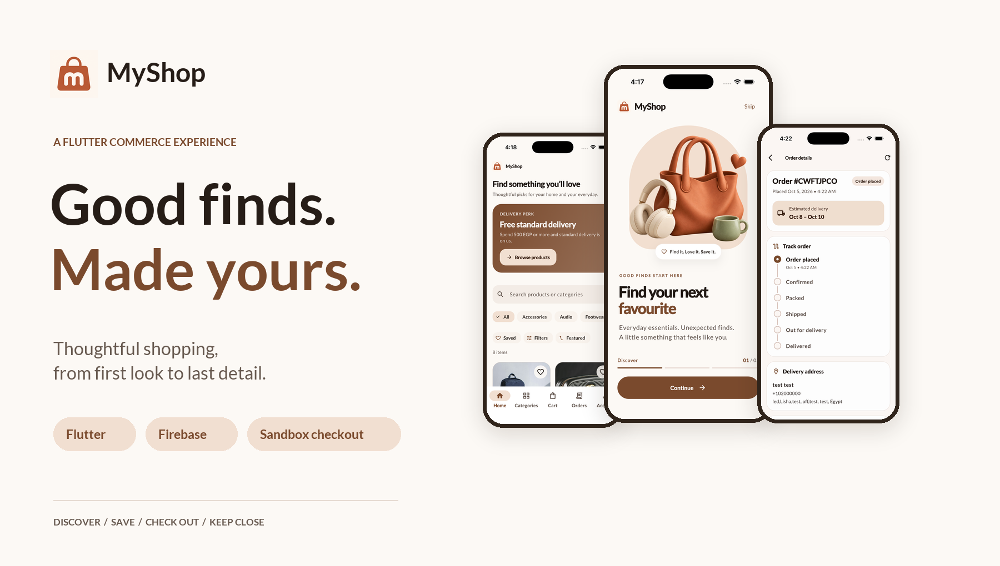
</a>

MyShop connects the whole shopping journey: a recognisable first launch, finding a favourite, building a basket, selecting delivery, completing a demo order, and returning to its details. A cream-and-terracotta identity ties the app icon, splash, onboarding and storefront together.

This is a **portfolio application** with sample catalog content and demo orders. Hosted card checkout runs in MyFatoorah Sandbox; it does not charge real money or arrange real deliveries.

## See the experience

**[Explore the interactive app-screen gallery](https://husseinabozina.github.io/shop_application/#screens)** · **[Download the Android demo](https://github.com/Husseinabozina/shop_application/releases/download/showcase-latest/myshop-demo.apk)**

These are **actual iPhone 17 Pro simulator captures**, supplied by the project owner on October 5, 2026. Order-detail views are frames from the same recording. Screens are resized for the README; their application content is preserved.

### A considered first impression

<table>
  <tr>
    <td align="center" width="25%"><a href="docs/showcase/screens/splash.png">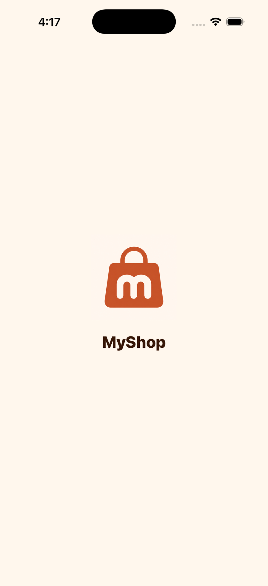</a><br/><strong>One clear identity</strong><br/><sub>Branded iPhone launch and splash</sub></td>
    <td align="center" width="25%"><a href="docs/showcase/screens/onboarding-discover.png">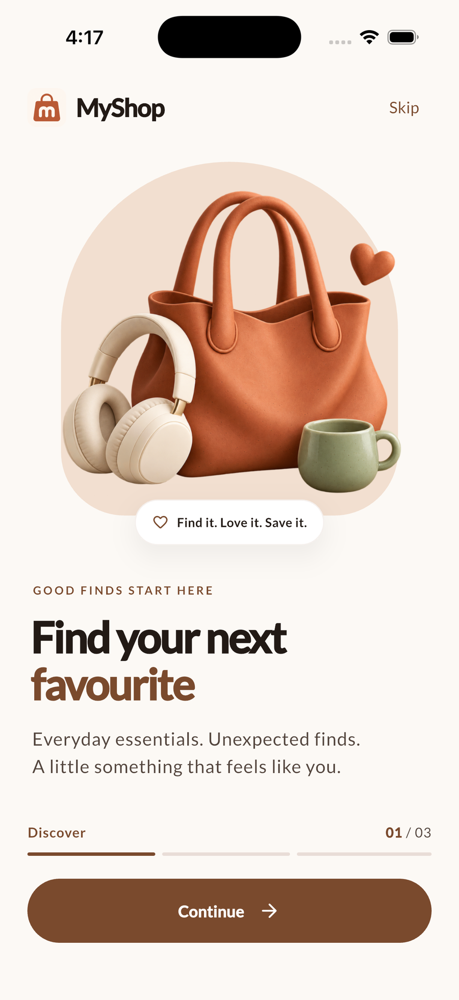</a><br/><strong>Find your favourite</strong><br/><sub>Discovery and saving</sub></td>
    <td align="center" width="25%"><a href="docs/showcase/screens/onboarding-basket.png">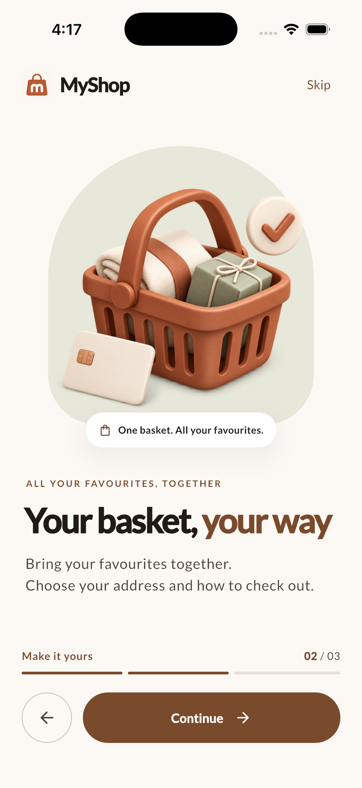</a><br/><strong>Make it yours</strong><br/><sub>Basket and checkout</sub></td>
    <td align="center" width="25%"><a href="docs/showcase/screens/onboarding-orders.png">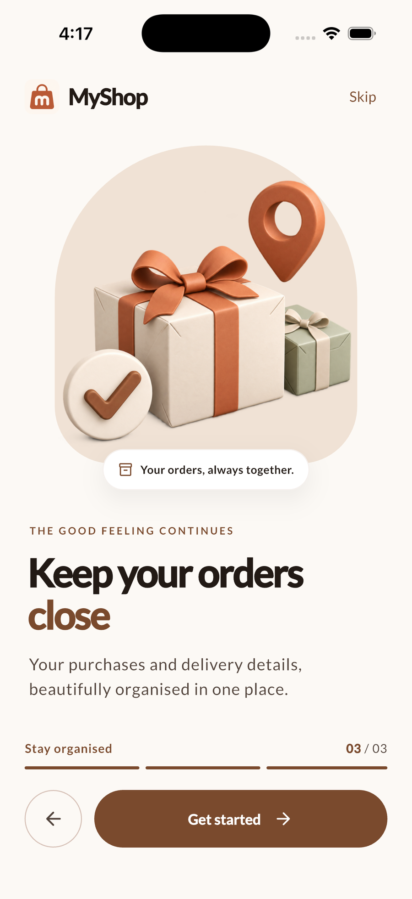</a><br/><strong>Keep it close</strong><br/><sub>Purchases in one place</sub></td>
  </tr>
</table>

The three welcome pages support swipe, Continue, Back and Skip. Completion is remembered on the installation. Finite entrance motion, swipe parallax and haptic feedback add personality; reduced-motion settings and larger text remain supported.

### From discovery to the details

<table>
  <tr>
    <td align="center" width="33%"><a href="docs/showcase/screens/home.png">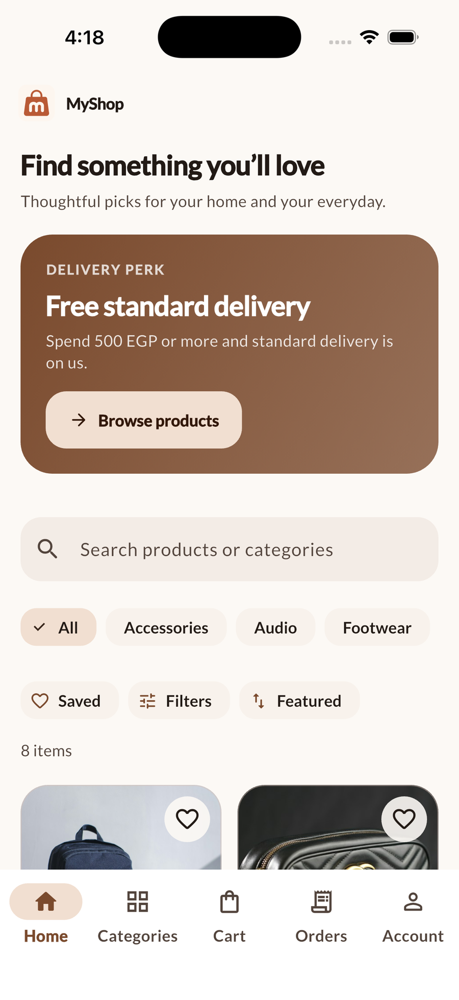</a><br/><strong>Discover something good</strong><br/><sub>Home, search and category discovery</sub></td>
    <td align="center" width="33%"><a href="docs/showcase/screens/product.png">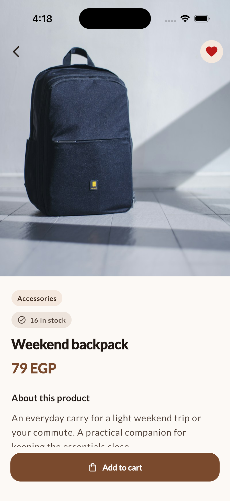</a><br/><strong>Look a little closer</strong><br/><sub>Product imagery, stock and saved items</sub></td>
    <td align="center" width="33%"><a href="docs/showcase/screens/order-details.png">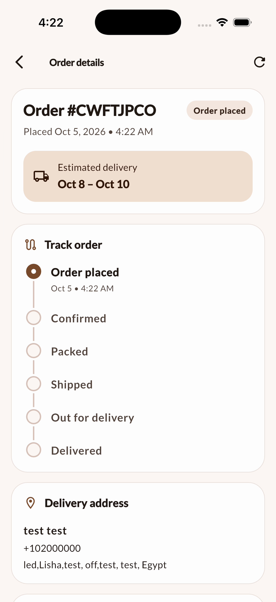</a><br/><strong>Follow the order</strong><br/><sub>Order details and delivery timeline</sub></td>
  </tr>
</table>

<details>
  <summary><strong>Explore the basket, checkout and complete order summary</strong></summary>
  <br/>
  <table>
    <tr>
      <td align="center" width="33%"><a href="docs/showcase/screens/cart.png">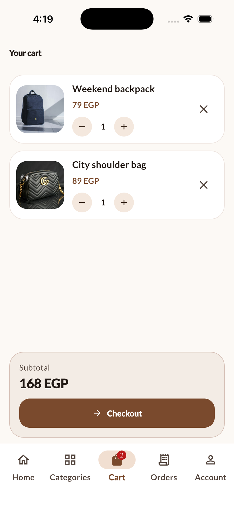</a><br/><strong>A basket that stays yours</strong></td>
      <td align="center" width="33%"><a href="docs/showcase/screens/checkout.png">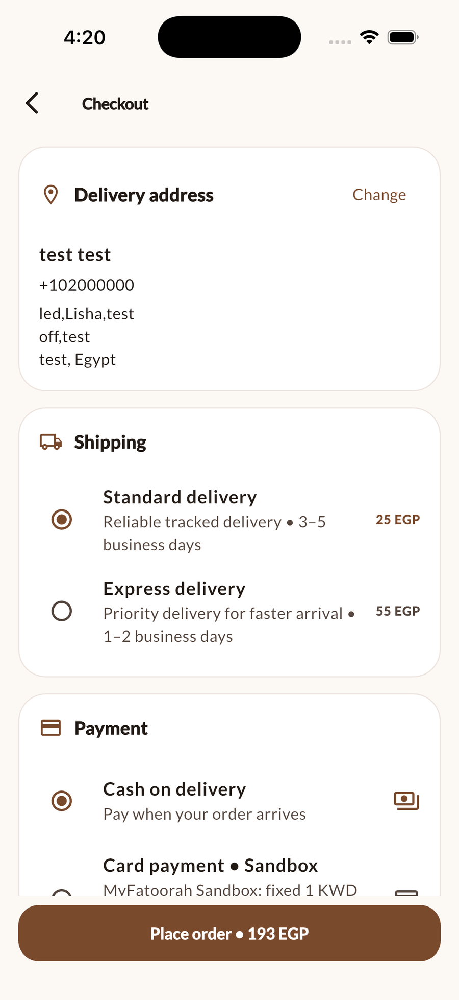</a><br/><strong>Choose the next step</strong></td>
      <td align="center" width="33%"><a href="docs/showcase/screens/order-summary.png">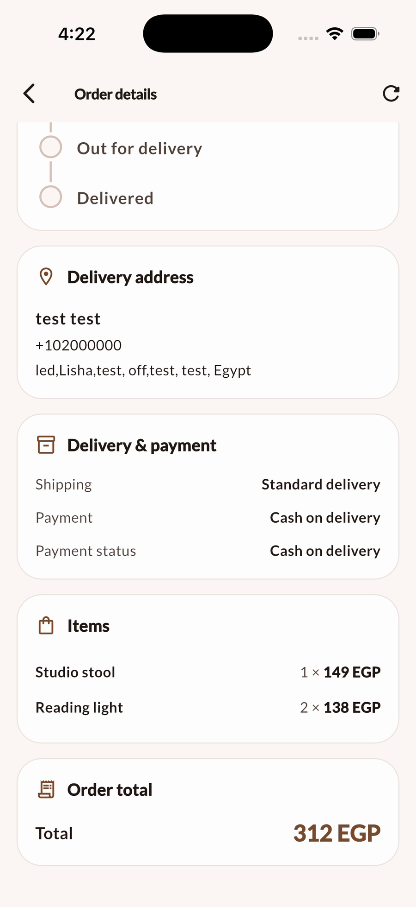</a><br/><strong>Every detail together</strong></td>
    </tr>
  </table>
</details>

## Watch it in motion

<div align="center">
  <a href="docs/showcase/myshop-demo.mp4">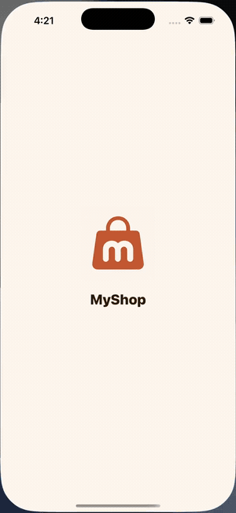</a>
  <p><strong><a href="docs/showcase/myshop-demo.mp4">Watch or download the 29-second walkthrough ↗</a></strong></p>
</div>

A selected cut of the running Flutter app: launch, onboarding, browsing, product details, the basket and order details. The public cut excludes sign-in and address-entry forms. [Capture sources and reproduction](docs/showcase/README.md).

## What the product does

| Journey | Implemented experience |
|---|---|
| Begin | Custom launcher icon, branded iPhone splash, three first-use welcome pages and saved completion |
| Discover | Categories, search, sorting, price and availability filters, swipeable product galleries and stock states |
| Save | Account-scoped favourites and recently viewed products |
| Build a basket | Persistent per-account cart, quantity limits, removal and stock preflight before checkout |
| Check out | Saved/default addresses, Standard or Express shipping, delivery estimates, promotions and EGP totals |
| Pay in a sandbox | Cash on Delivery demo orders or hosted MyFatoorah test checkout, verified results and saved-attempt recovery |
| Return to an order | Private history, status filters, refresh, purchased items, delivery/payment details and a status timeline |
| Manage a catalog | User-owned product creation/editing and an optional eight-item sample collection |

## Engineering worth inspecting

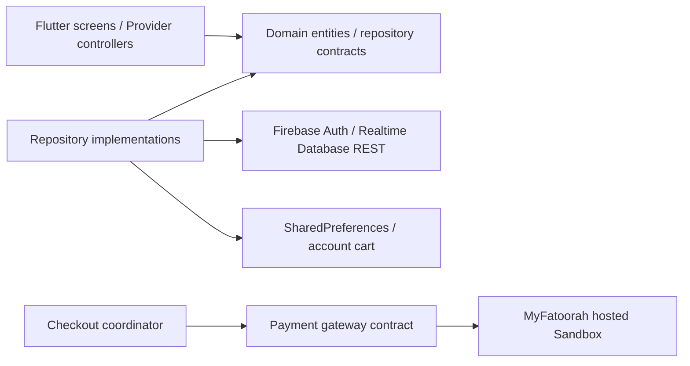

The app is being migrated incrementally from its original learning-project structure into feature-first layers. New commerce features separate presentation, domain contracts and data implementations; the composition layer chooses the concrete repositories.

| Decision | Why it matters | Evidence |
|---|---|---|
| Account-scoped storage | Signing into another account must not carry over a previous customer's basket or private state | [Cart repository](lib/features/cart/data/repositories/local_cart_repository.dart) · [Shopping journey checks](test/screens/storefront_journey_test.dart) |
| Verified payment results | Returning from a browser alone does not prove payment | [Sandbox integration](docs/sandbox-payments.md) |
| Duplicate-order protection | Rechecking or retrying one invoice must not create another order | [Payment tests](test/features/payments/sandbox_payment_test.dart) |
| Enforced ownership | Firebase rules protect private customer data and user-owned catalog writes | [Database rules](database.rules.json) · [Emulator verification](security-tests/README.md) |
| Accessible first use | Navigation, remembered completion, storage retry, larger text and reduced motion are covered | [Startup flow checks](test/screens/startup_flow_test.dart) |
| Complete order review | The shopping journey continues into delivery, payment and purchased-item details, including a compact layout | [Order detail screen](lib/features/orders/presentation/screens/order_details_screen.dart) |

**Quality:** [Flutter CI](https://github.com/Husseinabozina/shop_application/actions/workflows/flutter_ci.yml) runs analysis/tests, iOS simulator and unsigned release builds, and an Android demo build. [Firebase CI](https://github.com/Husseinabozina/shop_application/actions/workflows/firebase_rules_test.yml) verifies ownership rules in the emulator. Workflow results are the current source of truth; no frozen test-count badge is used.

## The visual language

| Cream | Cocoa | Terracotta | Motion |
|---|---|---|---|
| `#FCF9F5` | `#7A4A2D` | Shopping bag identity | Finite reveals, gentle swipe depth and reduced-motion support |

Material 3 surfaces, bundled Lato typography, rounded cards and a restrained action colour keep the storefront consistent. The onboarding artwork was generated specifically for MyShop and ships locally with the app. [Design system](docs/DESIGN_SYSTEM.md) · [Artwork prompts and files](docs/onboarding-art.md).

## Demo scope

- **Card payments:** a fixed **virtual 1 KWD** MyFatoorah invoice is separate from the EGP basket. MyShop verifies identity, reference, amount, currency and Paid status before storing one demo order. Confirmation requires the app to be open or a manual recheck; there is no server payment webhook.
- **Delivery:** dates and the status timeline are demo presentation. Later order status changes require a trusted backend/admin. They are not courier tracking.
- **Inventory:** checkout checks availability, but the server does not reserve or decrement stock atomically.
- **Data:** Firebase-backed accounts, addresses and orders are implemented. Sample names, photos and prices are illustrative. Digital wallets, variants, reviews and order push notifications are not implemented.

## Run locally

Use a Flutter SDK compatible with Dart 3.5+. The current app was checked locally with **Flutter 3.38.5**; CI installs stable Flutter. iPhone builds require macOS/Xcode, and physical devices require Apple signing.

```sh
git clone https://github.com/Husseinabozina/shop_application.git
cd shop_application
flutter pub get
flutter run
```

The branded showcase and commerce implementation are now included in the default `master` branch. [See the merged development history](https://github.com/Husseinabozina/shop_application/pull/18).

Sign in or create a test account. If Home is empty, choose **Explore sample collection → Add sample collection**. Setup adds missing sample listings without replacing existing products. The same action is available from **Account → Manage products → Sample collection**.

```sh
flutter analyze --no-fatal-infos
flutter test
```

This checkout contains all of its own application source and assets. It does **not** depend on another local `shop_application` folder; the Dart package name and the folder name do not need to match. See [setup and multiple-checkout guidance](docs/DEVELOPMENT_SETUP.md).

### Demo builds

**[Download the Android ARM64 demo APK](https://github.com/Husseinabozina/shop_application/releases/download/showcase-latest/myshop-demo.apk)** — version 1.0.1+2, published unchanged from a verified CI build. [Release notes and checksum](https://github.com/Husseinabozina/shop_application/releases/tag/showcase-latest).

The latest successful [Flutter CI run](https://github.com/Husseinabozina/shop_application/actions/workflows/flutter_ci.yml) provides an Android ARM64 demo APK, an unsigned iOS release and automated UI captures. Artifacts expire after 30 days; the images in this README are committed and remain available. The iOS archive needs signing before installation on a physical iPhone. [Release handoff](docs/DEMO_RELEASE.md).

## Explore the project

| Resource | What to inspect |
|---|---|
| [Live portfolio](https://husseinabozina.github.io/shop_application/) · [Website source and publishing](portfolio/README.md) | Interactive real-screen gallery, film and Android download |
| [Architecture](docs/ARCHITECTURE.md) | Feature and repository boundaries |
| [Development setup](docs/DEVELOPMENT_SETUP.md) | One complete checkout, iPhone startup and duplicate-folder clarity |
| [Firebase schema](docs/FIREBASE_SCHEMA.md) | Stored data and ownership |
| [Environment](docs/ENVIRONMENT.md) | Backend overrides and redacted HTTP logging |
| [Sandbox payments](docs/sandbox-payments.md) | Test card, recovery and verification |
| [Showcase media](docs/showcase/README.md) | Original capture mapping, video selection and reproducible cover |
| [Commerce roadmap](docs/COMMERCE_ROADMAP.md) | Implemented work and remaining product scope |

**Hussein Abozina** · [GitHub](https://github.com/Husseinabozina) · [NOVA Fashion](https://github.com/Husseinabozina/fashion_e_commerce) · [Brees](https://github.com/Husseinabozina/Brees-Mobile-App) · [HealthTrack](https://github.com/Husseinabozina/medical_app)

Product photos and third-party marks appear as sample catalog content; no brand affiliation is implied.
